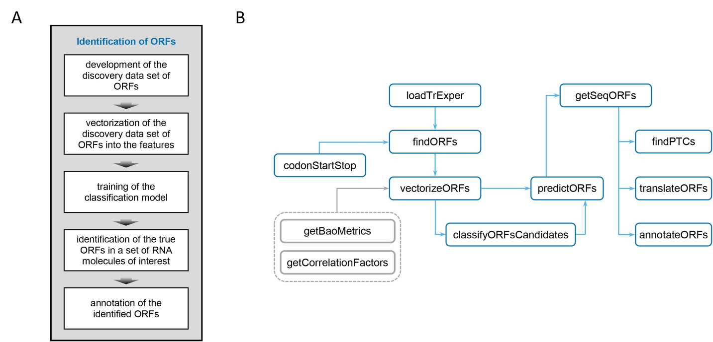

## ORFhunteR: an accurate approach for the automatic identification and annotation of open reading frames in human mRNA molecules

The ORFhunteR package is a R and C++ library for an automatic identification and annotation of open reading frames (ORFs) in a large set of RNA molecules. It efficiently implements the machine learning model based on vectorization of nucleotide sequences and the random forest classification algorithm. The ORFhunteR package consists of a set of functions written in the R language in conjunction with C++. The efficiency of the package was confirmed by the examples of the analysis of RNA molecules from the NCBI RefSeq and Ensembl databases. The package can be used in basic and applied biomedical research related to the study of the transcriptome of normal as well as altered (for example, cancer) human cells.



Fig. (A) The main stages for automatic identification of ORFs in RNA molecules.
(B) The functional structure of ORFhunteR package.

### Installation
Package is available from bioconductor 3.13 (R version >= 4.0.0)
```r
if (!requireNamespace("BiocManager", quietly=TRUE))
    install.packages("BiocManager")
BiocManager::install("ORFhunteR")
```

Package is also available on github
```r
library(devtools)
install_github("rfctbio-bsu/ORFhunteR")
```  

### Quick start
Read vignette
```r
browseVignettes("ORFhunteR")
``` 

### Contact
bioinformatics.rfct.bio.bsu@gmail.com

### References
ORFhunteR: an accurate approach for the automatic identification and annotation of open reading frames in human mRNA molecules. Vasily V. Grinev, Mikalai M. Yatskou, Victor V. Skakun, Maryna K. Chepeleva, Petr V. Nazarov. bioRxiv 2021.02.05.429963; doi: https://doi.org/10.1101/2021.02.05.429963

Yatskou M. M., Skakun V. V., Grinev V. V. Development of a computational approach for automatic determination of open reading frames in human RNA molecules. // Quantum electronics: materials of the XII International Scientific and Technical Conference, Minsk, 18-22 November 2019 / Editorial board: Kugeiko M. M. [and others]. - Minsk: RIVSH, 2019. pp. 279-281.

Skakun V. V., Yatskou M. M., Nazarov P. V., Grinev V. V. ORFhunteR software package for automatic detection of open reading frames in human RNA molecules. // Computer Technology and Data Analysis (CTDA’2020): materials of the II International Scientific and Practical Conference, Minsk, 23-24 April 2020 / Editorial board: Skakun V. V. (editor-in-chief) [and others]. - Minsk: BSU, 2020. pp. 20-24.
