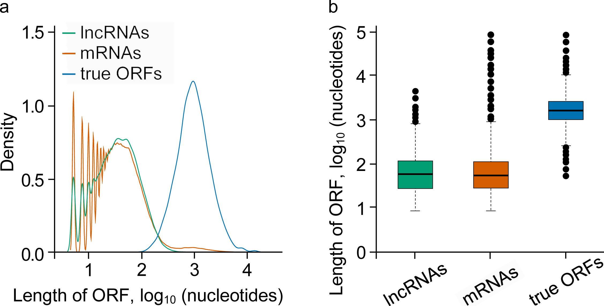
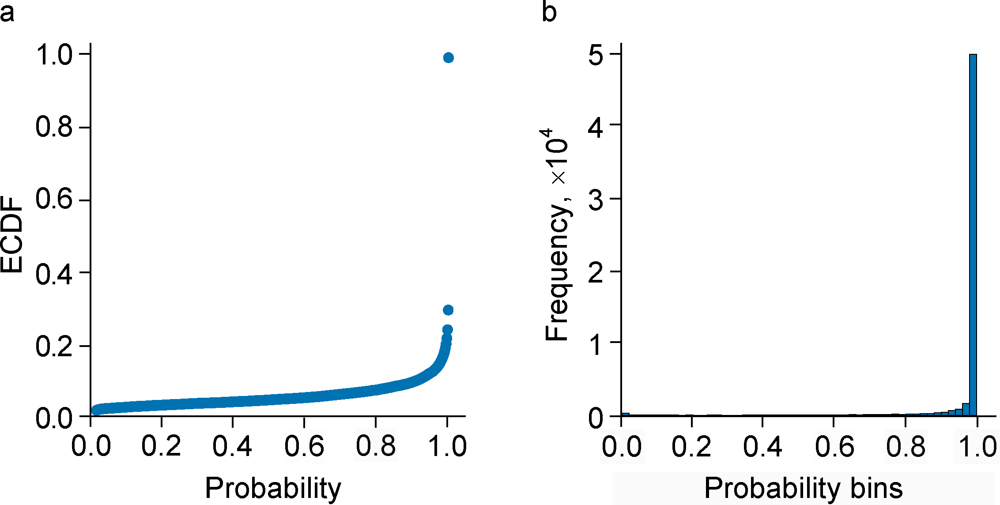
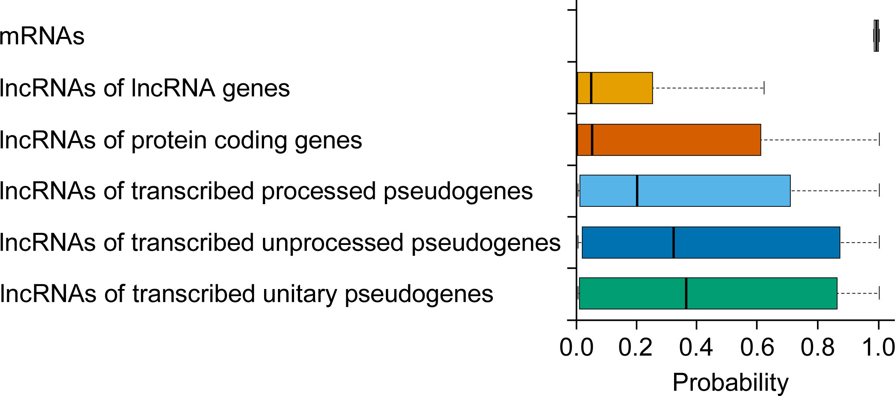

```{r setup, include=FALSE}
knitr::opts_chunk$set(
  collapse = TRUE,
  comment = "#>"
)
```

<font size="2">This document describes the usage of the functions integrated in the package and is meant to be a reference document for the end user. </font>

<font size="2">The ORFhunteR package is considered stable and will undergo few changes from now on. Please, report potential bugs and incompatibilities to  <bioinformatics.rfct.bio.bsu@gmail.com>. </font>

The usage of the package functions for an automatic determination and annotation of open reading frames (ORFs) is shown for an example set of 50 mRNA molecules loaded from the Ensembl. The path to the data set `trans_sequences.fasta` is available as
```{r}
trans  <- system.file("extdata", "Set.trans_sequences.fasta",
                      package = "ORFhunteR")
```

# Installing and loading the package
Load the package with the following command:
```{r, eval = FALSE }
if (!requireNamespace("BiocManager", quietly = TRUE)) { 
    install.packages("BiocManager")
}
BiocManager::install("ORFhunteR")
```
```{r, echo=T, results = 'hide'}
library('ORFhunteR')
```

# Data availability
The most important data sets are available with package as an external data. Furthermore, a number of additional data used in this vignette can be downloaded from our SST Center server. 

# Data loading
You can load the data file of the mRNA molecules with the following command:
```{r}
seq.set <- loadTrExper(tr = trans)
```
where the function argument `tr` is a character string giving the name of file with transcripts of interest. Allowed file formats are `fasta` or `fa`. Alternative formats are `gtf` or `gff`. With `gtf` or `gff` formats, additional argument genome should be specified. This argument gives the name of pre-installed BSgenome data package with full genome sequences. Default value is `BSgenome.Hsapiens.UCSC.hg38`.
Irrespective used format of input file, the function `loadTrExper` returns a list of loaded transcript sequences. Each element of this list is character string of nucleotides sequence.

# Inferring of ORF candidates
All possible in-frame ORF candidates in a sequence of interest can be determined by function `findORFs`:
```{r}
x <- "AAAATGGCTGCGTAATGCAAAATGGCTGCGAATGCAAAATGGCTGCGAATGCCGGCACGTTGCTACGT"
orf <- findORFs(x, codStart="ATG")
```
where the function argument `x` is a character string giving the nucleotide sequence of interest. In current implementation, the function `findORFs` scans the sequence for all sub-sequences that start with ATG start codon and end in-frame with a stop codon.
The function findORFs returns a matrix with start and stop positions in RNA molecule, length and sequence of identified variants of ORFs. In fact, the predominant amount of identified ORF candidates are short pseudo-ORFs (see below), as demonstrated in Figure 1.
```{r echo=FALSE, out.width='75%', fig.align="center"}

```
Figure 1. Distribution of the length of ORF candidates from lncRNAs and mRNAs and length of true ORFs derived from NCBI RefSeq annotations of human genes. This figure is based on NCBI RefSeq release 109 (GRCh38.p12 human genome assembly).

#Vectorization of the sequence features of ORFs
The function `vectorizeORFs` extracts and vectorizes the sequences features of ORFs:
```{r}
feats <- vectorizeORFs(x=DNAStringSet(x="ATGGGCCTCA"))
```
where the function argument `x` is a DNAStringSet object with ORF sequence.
For each ORF, the function `vectorizeORFs` calculates 104 sequence features: frequency of mono-, di- and trinucleotides (84 features in total), parameters of the Bao model representing the local frequency entropy values of sequences (12 features in total) (Bao J. et al., 2014), correlation factors of nucleotides and length of ORF (8 features in total). As was shown in numerous studies, these features are informative for classification of coding and non-coding RNA molecules. This function returns the object of class data.frame with ORF vectorized into sequence features.

#Calculation of the classification model

The function `classifyORFsCandidates` builds a randomForest classifier for the ORF candidates:
```{r, eval = FALSE}
## The files with sequences can be downloaded from SST Center server at www.sstcenter.com/download/ORFhunteR

fileORFLncRNAs <- "http://www.sstcenter.com/download/ORFhunteR/NCBI_RefSeq_release_109_GRCh38.p12_ORF_candidates_sequences_lncRNAs.fasta.gz"
ORFLncRNAs <- loadTrExper(tr = fileORFLncRNAs)
fileORFmRNAs <- "http://www.sstcenter.com/download/ORFhunteR/NCBI_RefSeq_release_109_GRCh38.p12_ORFs_true_sequences_mRNAs.fasta.gz"
ORFmRNAs <- loadTrExper(tr = fileORFmRNAs)
## Make the train dataset from N pseudo- and N real ORFs.
N <- 1000
ORFLncRNAs <- ORFLncRNAs[1:N]
ORFmRNAs <- ORFmRNAs[1:N]
## Calculate the classification model for the open reading frame.
clt <- classifyORFsCandidates(ORFLncRNAs = ORFLncRNAs,
                              ORFmRNAs = ORFmRNAs,
                              pLearn = 0.75, 
                              nTrees = 500,
                              modelRF = NULL,
                              workDir = NULL,
                              showAccuracy = TRUE)
```
where the function argument `ORFLncRNAs` is the object of the class list of pseudo-ORFs, `ORFmRNAs` is the object of the class list of coding true ORFs, `pLearn` is a threshold, in fractions of one, for random selecting the train set of ORFs (the rest amount, or 1-pLearn, is thus left for the test set of ORFs; default value is 0.75), `nTrees` is a number of trees to grow (this should not be set to too small a number, to ensure that every input row gets predicted at least a few times; default value is 500), `modelRF` is character string, giving the name of RDS-file to store the classification model (NULL is by default), and `workDir` is character string giving the path to and the name of the work directory (NULL is by default that means the current working directory). Here and below, pseudo-ORFs are nucleotide sequences of long non-coding RNA molecules that beginning with ATG start codon and ending in-frame with one of the stop codons, but these sequences are not translated into proteins. We also use this term for non-coding mRNA-derived nucleotide sequences (usually short) with features of ORFs.

The function `classifyORFsCandidates` returns an object of class randomForest (Liaw A. et al., 2002) that can be used for subsequent automatic determination of ORFs in experimental RNA molecules of interest. In addition, the function automatically saves the RDS file of the classification model `modelRF` into the directory `workDir` and generates:
i)	the randomForest type plots: the sorted variable importance, the error rates, and the dotchart of variable importance as measured by a classification model;
ii)	the evaluation estimates of the classification model on the train and test datasets: the confusion matrix and the measures of Accuracy, Precision, Recall, and the Score F1, calculated as

Accuracy	$$Accuracy = \frac{TP + TN}{TP + TN + FP + FN}$$
Precision	$$Precision = \frac{TP}{TP + FP}$$
Recall	$$Recall = \frac{TP}{TP + FN}$$
The Score F1 $$The Score F1 = \frac{2 * TP}{2 * TP + FP + FN}$$

where TP – true positive (the positive class is predicted as the positive class number); FN – false negative (the positive class is predicted as the negative class number); FP – false positive (the negative class is predicted as the positive class number); TN – true negative (the negative class is predicted as the negative class number).

# Automatic identification of true ORFs
With calculated classification model, identification of the true ORFs among ORF candidates extracted from RNA molecules of interest can be done using function `predictORF`:
```{r}
model <- "http://www.sstcenter.com/download/ORFhunteR/classRFmodel_1.rds"
ORFs <- predictORF(tr = trans,
                   model= model,
                   prThr = 0)
```
where the function argument `tr` is a character string giving the name of file with transcripts of interest, `model` is a character string giving the connection or full path to the file from which the classification model is read, and argument `prThr` is probability threshold for the "winning" class of ORFs (default value is 0). Allowed file formats for transcripts of interest are `fasta` or `fa`. Alternative formats are `gtf` or `gff`. With `gtf` or `gff` formats, additional argument `genome` should be specified. This argument gives the name of pre-installed BSgenome data package with full genome sequences. Default value is "BSgenome.Hsapiens.UCSC.hg38".
The function `predictORF` returns an object of class data.frame with five fields:
```{r}
head(ORFs)
```
The function `predictORF `selects only one ORF candidate per RNA molecule that was assigned with maximal value of `prob` field. In fact, 91.9% of ORFs that were identified in mRNA molecules (Ensembl release 97, GRCh38.p12 human reference genome assembly) demonstrates probability \geqslant 0.9 (Figure 2).
```{r echo=FALSE, out.width='75%', fig.align="center"}

```
Figure 2. Empirical cumulative distribution (a) and frequency (b) of probability values for ORFs that were identified in Ensembl human mRNA molecules.
At the same time, distribution of probability values for ORF candidates from long non-coding RNA molecules is completely differ (Figure 3). This difference between two classes of RNA molecules makes it possible to set a probability threshold prThr that discriminates pseudo- and true ORFs.
```{r echo=FALSE, out.width='75%', fig.align="center"}

```
Figure 3. Boxplot demonstrating the distribution of probability values for ORFs that were identified in human mRNAs and lncRNAs (Ensembl release 97, GRCh38.p12 human reference genome assembly).

# Extraction the sequences of identified ORFs
The sequences of identified can be extracted with function `getSeqORFs`:
```{r}
orfs_path <- system.file("extdata",
                         "Set.trans_ORFs.coordinates.txt",
                         package="ORFhunteR")
tr_path <- system.file("extdata",
                       "Set.trans_sequences.fasta",
                       package="ORFhunteR")
seq_orfs <- getSeqORFs(orfs = orfs_path,
                       tr = tr_path,
                      genome="BSgenome.Hsapiens.UCSC.hg38",
                       workDir=NULL)
```
This function needs the name of tab-delimited TXT file with coordinates of ORFs (as generated by function `predictORF`) and the name of file with transcripts of interest. The last file must include the transcripts for which the ORFs were identified and listed in above file with coordinates of ORFs. Allowed file formats for transcripts of interest are `fasta` or `fa`. Alternative formats are `gtf` or `gff`. With `gtf` or `gff` formats, additional argument `genome` should be specified. This argument gives the name of pre-installed BSgenome data package with full genome sequences. Default value is `BSgenome.Hsapiens.UCSC.hg38`.
The output of function `getSeqORFs` is a DNAStringSet object with sequences of ORFs:
```{r}
head(seq_orfs)
```
# Annotation of identified ORFs
## Detection of premature termination codons (PTCs)
With identified ORFs, the PTCs can be inferred using function `findPTCs`:
```{r}
orfs_path <- system.file("extdata",
                         "Set.trans_ORFs.coordinates.txt",
                         package="ORFhunteR")
gtf_path <- system.file("extdata",
                        "Set.trans_sequences.gtf",
                        package="ORFhunteR")
ptcs <- findPTCs(orfs = orfs_path,
                 gtf = gtf_path, 
                 workDir = NULL)
```
This function needs the name of tab-delimited TXT file with coordinates of ORFs (as generated by function `predictORF`) and the name of file with structure of transcripts in format `gtf` or `gff`. The output of function `findPTCs` is an object of class data.frame with field `stop.status`:
```{r}
head(ptcs)
```

## In silico translation of identified ORFs
In silico translation of identified ORFs can be done with function `translateORFs`:
```{r}
seq_orf_path <- system.file("extdata",
                            "Set.trans_ORFs.sequences.fasta",
                            package="ORFhunteR")
prot_seqs <- translateORFs(seqORFs=seq_orf_path)
```
This function accepts `fasta` (or `fa`) file with sequences of identified ORFs (as generated by function `getSeqORFs`) and translates these sequences into strings of amino acids according to standard genetic code. The output of function `translateORFs` is an AAStringSet object with amino acid sequences:
```{r}
head(prot_seqs)
```
If necessary, the coding of amino acid symbols can be switched from one-letter to three-letter using argument `aaSymbol` of function.

## Basic annotation of identified ORFs
The package ORFhunteR includes function `annotateORFs` for basic annotation of identified ORFs. This function works according to following syntax:
```{r}
orfs_path <- system.file("extdata",
                         "Set.trans_ORFs.coordinates.txt",
                         package="ORFhunteR")
tr_path <- system.file("extdata",
                       "Set.trans_sequences.fasta",
                       package="ORFhunteR")
gtf_path <- system.file("extdata",
                        "Set.trans_sequences.gtf",
                        package="ORFhunteR")
prts_path <- system.file("extdata",
                         "Set.trans_proteins.sequences.fasta",
                         package="ORFhunteR")
anno_orfs <- annotateORFs(orfs = orfs_path,
                          tr = tr_path,
                          gtf = gtf_path,
                          prts = prts_path,
                          workDir = NULL)
```
The function `annotateORFs` needs five arguments. The argument `orfs` is the name of tab-delimited TXT file with coordinates of ORFs (as generated by function predictORF). The argument `tr` is a character string giving the name of file with transcripts of interest. This file must include the transcripts for which the ORFs were identified and listed in above file with coordinates of ORFs. Allowed file formats for transcripts of interest are `fasta` or `fa`. The argument `gtf` is the name of file with structure of transcripts in format `gtf` or `gff.` The argument `prts` is a character string giving the name of `fasta` file with sequences of in silico translated proteins encoded by identified ORFs (as generated by function `translateORFs`). The last argument `workDir` is a character string giving the path to and name of work directory (NULL by default that mean the current working directory).
The function `annotateORFs` returns an object of class data.frame. This object includes information on each analysed transcript: transcript ID, length of 5'UTRs, type of start codon, start coordinate of ORF, stop coordinate of ORF, type of stop codon, PTC status of stop codon, length of ORF, length of 3'UTRs, molecular weight of in silico translated protein, isoelectic point of a protein sequence and potential protein interaction index.
```{r}
head(anno_orfs)
```

# Citation
If you use the ORFhunteR package for a scientific work, then please cite (Yatskou M. M. et al., 2019) and (Skakun V. V. et al., 2020). 

# References 
Bao J., Yuan R., Bao Z. An improved alignment-free model for DNA sequence similarity metric. // BMC Bioinformatics. – 2014. – Vol. 15. – P. 321. doi: 10.1186/1471-2105-15-321

Liaw A., Wiener M. Classification and regression by randomForest. // R News. – 2002. – Vol. 2. – P. 18-22.

Skakun V. V., Yatskou M. M., Nazarov P. V., Grinev V. V. ORFhunteR software package for automatic detection of open reading frames in human RNA molecules. // Computer Technology and Data Analysis (CTDA’2020): materials of the II International Scientific and Practical Conference, Minsk, 23-24 April 2020 / Editorial board: Skakun V. V. (editor-in-chief) [and others]. – Minsk: BSU, 2020. pp. 20-24.

Yatskou M. M., Skakun V. V., Grinev V. V. Development of a computational approach for automatic determination of open reading frames in human RNA molecules. // Quantum electronics: materials of the XII International Scientific and Technical Conference, Minsk, 18-22 November 2019 / Editorial board: Kugeiko M. M. [and others]. – Minsk: RIVSH, 2019. pp. 279-281.
